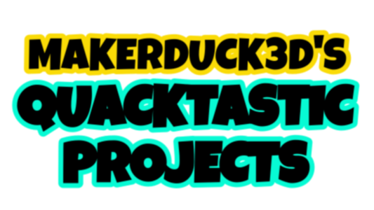

Hi! Here you can find source code for my website.

Visit it here: [MakerDuck3D's Quacktastic projects](https://makerduck3d.github.io/Quacktastic-projects/index.html)

It consists mainly of CSS and HTML, but I plan to use JavaScript more in the future.

If you have any idea, how to improve the site, feel free to contribute.

### Current list of the sites

* Quacktastic Projects (EN, CZ)
* DUCK Ecosystem
* JTF 3D Models
* Shogi 3D

Font credits and licenses can be found in this file: fonts/fonts-readme.txt

Code and website contents licensed under [MIT](https://choosealicense.com/licenses/mit/) if not stated otherwise on the page.

I hope you'll like it.

*MakerDuck3D*

